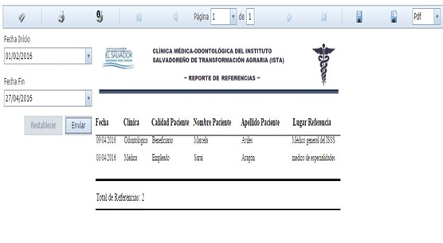

## Pasantia 22.1 | Ciancoders
## Proyecto Final :
----
## Sistema Informatico de Administracion de Pacientes, Control de Citas e Inventario de la Clínica Esperanza de vida.

## Objetivo general:

Desarrollar un Sistema Informático de Administración de Pacientes, Control de Citas e 
Inventario para la Clínica Esperanza de vida. 

----

## Objetivos especificos:

- Construir los elementos del sistema informático de            Administración de pacientes, control de Citas e Inventario para la Clínica Esperanza de vida que sea funcional y facilite la realización de las tareas de los usuarios.

- Probar la solución del sistema informático de Administración de pacientes,control de citas e inventario para la Clínica Esperanza de vida para presentar productos de calidad.

- Documentar la solución del Sistema informático de administración de pacientes, control de Citas e inventario para la Clínica esperanza de vida para facilitar su mantenimiento.

## Definicion de requerimientos
### Requerimientos funcionales
---- 
| Código 	    | Requerimientos |
|---------------|----------------| 
| RF1 	        | Expediente clínico |
| RF1.1 	    | Gestión de expediente clínico. | 
| RF1.1.1 	    | Crear expediente clínico de paciente. |  
| RF1.1.1.1 	| Crear expediente clínico de empleado. |
| RF1.1.1.2 	| Crear expediente clínico de beneficiario. |  
| RF1.1.2 	    | Buscar expedientes clínicos registrados en el sistema. |
| RF1.1.3 	    | Actualizar expedientes clínicos  registrados en el sistema. |
| RF1.1.4 	    | Crear receta médica. | 
| RF1.1.4.1 	| Imprimir documento de recetas. | 
| RF1.1.5 	    | Crear incapacidad. |
| RF1.1.5.1 	| Imprimir documento de incapacidades. |
| RF1.1.6 	    | Crear referencia. | 
| RF1.1.6.1 	| Imprimir documento de referencias. | 
| RF1.2 	    | Generar reporte de incapacidades. |
| RF1.2.1 	    | Imprimir reporte de incapacidades.| 
| RF1.3 	    | Generar reporte de recetas. |
| RF1.3.1 	    | Imprimir reporte de recetas. | 
| RF1.4 	    | Generar reporte de referencias. |
| RF1.4.1 	    | Imprimir reporte de referencias. | 
| RF1.5 	    | Generar reporte de consultas. |
| RF1.5.1 	    | Imprimir reporte de consultas. | 
| RF1.6 	    | Gestión de pacientes. |
| RF1.6.1 	    | Agregar nuevos beneficiarios. | 
| RF1.6.2 	    | Consultar los beneficiarios registrados en el sistema. |
| RF1.6.3 	    | Modificar datos de los beneficiarios registrados en el sistema. |
| RF1.7 	    | Generar reporte de beneficiarios. |
| RF1.7.1 	    | Imprimir reporte de beneficiarios. |
|---------------|------------------------------------|
| RF2 	        | Insumos médicos |
| RF2.1 	    | Gestión de solicitudes de insumos. |
| RF2.1.1 	    | Crear solicitud de insumos. |
| RF2.1.1.1 	| Imprimir documento de solicitud de insumos. |
| RF2.1.2 	    | Modificar solicitud de insumos. |
| RF2.1.2.1 	| Imprimir documento de solicitud de insumos modificada. |
| RF2.1.3 	    | Buscar solicitudes de insumos. |
| RF2.1.4 	    | Ingresar solicitud de insumos. |
| RF2.2 	    | Gestión de insumos. |
| RF2.2.1 	    | Consultar la “cantidad” de insumos médicos en existencia. |
| RF2.2.1.1 	| Imprimir lista de insumos con su respectiva cantidad en existencia. |
| RF2.2.2 	    | Agregar un nuevo ítem (insumo y sus características). |
| RF2.2.3 	    | Modificar datos de ítems registrados en el sistema. |
| RF2.2.4 	    | Consultar ítems registrados en el sistema. |
| RF2.2.5 	    | Eliminar ítem, que por algún motivo no se utilizara en la clínica. |
|---------------|--------------------------------------------------------------------| 
| RF3 	    | Citas médicas |
| RF3.1 	| Gestión de citas. |
| RF3.1.1 	| Crear cita médica. |
| RF3.1.1.1 | Imprimir documento que respalde la creación de la cita médica. |
| RF3.1.2 	| Modificar cita médica. |
| RF3.1.2.1 | Imprimir documento que respalde la modificación de la cita médica. |
| RF3.1.3 	| Consultar las citas médicas que están registradas en el sistema. |
| RF3.1.4 	| Eliminar citas médicas. |
| RF3.2 	| Generar reporte de citas médicas diarias. |
| RF3.3 	| Generar reporte de citas médicas mensuales. |
| RF3.4 	| Generar reporte de citas médicas anual. |
| RF3.5 	| Imprimir los reportes de citas médicas. |
|-----------|-----------------------------------------|
| RF4 	    | Administración | 
| RF4.1 	| Gestión usuarios. | 
| RF4.1.1 	| Agregar nuevos usuarios que podrán hacer uso del sistema. |
| RF4.1.2 	| Consultar usuarios registrados en el sistema. |
| RF4.1.3 	| Modificar datos de los usuarios registrados en el sistema. |
| RF4.1.4 	| Eliminar usuarios que por algún motivo no podrán acceder al sistema. |
|-----------|----------------------------------------------------------------------|
| RF5 	    | Seguridad de acceso |
| RF5.1 	| Contar con la autenticación de usuario, un usuario podrá ingresar al sistema por medio de una contraseña asignada a él. |
| RF5.2 	| Bloquear al usuario que haya efectuado un cierto número de intentos fallidos de ingreso al sistema. |
| RF5.3 	| Especificar que tareas puede realizar un usuario dentro del sistema. |
| RF5.4 	| Cada usuario podrá modificar su propia contraseña. |
| RF5.5 	| Se validaran los datos antes de ser ingresados al sistema. |
| RF5.6 	| Comunicar al usuario de posibles errores al introducir datos. |
----
### Lista requerimientos no funcionales 
| Código 	| Requerimientos |
|-----------|----------------| 
| RNF1 	    | Amigabilidad | 
| RNF1.1 	| Desarrollar el „manual de usuario‟ para facilitar el manejo del sistema a los |usuarios de las clínicas y de recursos humanos. |
| RNF1.2 	| Utilizar el idioma español para los mensajes y textos en la interfaz gráfica. |
| RNF1.3 	| Desarrollar un menú de opciones estándar en las diferentes ventanas. |
| RNF2 	    | Disponibilidad |
| RNF2.1 	| El sistema debe de estar disponible de forma continua durante la jornada laboral de los usuarios. |
| RNF2.2 	| En caso de fallas, no debe de haber pérdida de información. 
| RNF3 	    | Mantenibilidad |
| RNF3.1 	| Desarrollar el „manual técnico‟, para posibles mejoras de la aplicación a futuro. |
| RNF3.2 	| Desarrollar „manual de instalación‟ y „el plan de implementación‟ que de referencia a los encargados del mantenimiento del sistema para la puesta en marcha. |
 
### Lista actor-objetivo. 

| Actor 		| Objetivo | 
|---------------|----------|
| Odontólogo 	| 1. Administrar el expediente clínico de los pacientes, ya sean trabajadores del ISTA o sus familiares. | 
|               | 2. Administrar las citas médicas. |
|               | 2.1 Dejar una cita médica para un paciente que necesite seguir un tratamiento. |
|               | 2.2 Recalendarizar citas médicas a un paciente que por algún motivo no pudo asistir a su cita previamente creada. |
|               | 2.3 Anular cita médica de un paciente. |
|               | 2.4 Consultar citas médicas que previamente han sido dejadas a los pacientes. |
|               | 3. Controlar los insumos médicos que utiliza. |
|               | 3.1 Revisar cantidad de insumos médicos. |
|               | 3.2 Elaborar solicitud de insumos médicos. |
|               | 4. Reportes. |
|               | 4.1 Elaborar reporte de consultas. |
|---------------|------------------------------------|
|  Médico 	    | 1. 	Administrar el expediente clínico de los pacientes que atiende.| 
|               |1.1. Buscar un expediente clínico de un paciente. |
|               |1.2. Agregar datos en hoja de consulta y tener actualizado con ello, el expediente clínico.| 
|               |2. Citas médicas. 
|               |2.1. Dejar una cita médica para un paciente que necesite seguir un tratamiento. |
|               |3. Reportes. |
|               |3.1. Elaborar reporte de consultas. |
|               |3.2. Elaborar reporte de incapacidades. |
|               |3.3. Elaborar reporte de referencias. |
|---------------| -------------------------------------| 
| Enfermera     |1. 	Administrar el expediente clínico.| 
|               |1.1. Elaborar el expediente clínico de aquel paciente que llegue a consultar a la clínica por primera vez. |
|               |1.2. Agregar los datos de un paciente en particular, en el área del expediente clínico que le corresponde, con esto tiene actualizado el expediente. |
|               |1.3. Buscar el expediente clínico de los pacientes, que ya hayan pasado consulta anteriormente. |
|               |2. Administrar las citas médicas en la clínica. |
|               |2.1. Recalendarizar citas médicas a un paciente que por algún motivo no pudo asistir a su cita previamente creada. |
|               |2.2. Consultar citas médicas que previamente han sido creadas |
|               |2.3. Anular citas médicas. |
|               |3. Controlar los insumos médicos que utilizan en la clínica. |
|		        |3.1. Consultar cantidad de insumos médicos. |
|               |3.2. Verificar la cantidad de un insumo médico en particular. |
|               |4. Reportes | 
|               |4.1. Elaborar reporte de citas | 
|---------------|-------------------------------|  
| Encargado de    |1. Administrar personal. |
| Clínicas (RRHH) |1.1 Administrar a los empleados. |
|                 |1.2 Administrar a los beneficiarios. |
|                 |2. Recibir reportes de diferentes actividades realizadas en las clínicas. |
|                 |3. Administrar insumos de las clínicas. |
|                 |3.1 Consultar cantidad de insumos médicos. |
|                 |3.2 Comprar y entregar insumos médicos a ambas clínicas. | 	
|                 |4. Administrar los reportes sobre insumos utilizados. |
|                 |4.1 Revisar reporte sobre insumos utilizados. | 
|                 |4.2 Revisar reporte sobre empleados o de familiares de empleados. | 
|-----------------|------------------------------------------------------------------|  
| Administrador del Sistema| 1. 	Administrar a los usuarios que tienen acceso al sistema.|  
|                 |1.1. Agregando a los usuarios que tengan permiso para acceder. | 
|                 |1.2. Cambiando datos a los usuarios según sea necesario. | 
|                 |1.3. Suspender a usuarios según se requiera, por algún motivo. | 
|                 |1.4. Consultar a los usuarios y sus datos. | 
----

### Diagramas
### Diagrama de clases

### partes

### UI interfaces de usuario 
1. Layout

- Encabezado: en esta área se mostrara el nombre de la aplicación y un logo de la institución, así como la opción de cerrar la sesión de trabajo y el link a los datos del usuario actual del sistema. 
 
- Menú vertical: esta área mostrara las opciones principales con las que contara la aplicación; éste menú puede variar según el usuario en ese momento. 
 
 
- Área de trabajo: esta área se utilizara para que el sistema muestre los diferentes formularios de captura de datos y los diferentes reportes que generará. 

2. Pantalla Principal

La descripción de la pantalla principal es la siguiente: 
Banner alusivo a la aplicación misma, contendrá el logo de la institución para la que se desarrolla el sistema y el nombre del sistema, también es esa área a la derecha se contará con el botón para cerrar la sesión del sistema y la opción de ver los datos del usuario que se encuentra registrado en ese momento. 
 
Menú principal con las opciones del sistema, éstas se activarán según los privilegios del usuario, las opciones son las siguientes: seguridad, extra, administración, charlas, citas, expediente e insumos. 
 
Área principal para el despliegue de la opción seleccionada en la cual se desplegaran las pantallas respectivas a la opción de menú seleccionada y mensajes del sistema de acuerdo a las tareas realizadas, por ejemplo, verificación de ingreso de datos. 
 
A continuación se muestran las interfaces del sistema y también una tabla donde se presentan los campos del sistema y de qué forma se obtienen para registrarlos en el sistema.

3. Iniciar Sesion

Ésta será la primera interfaz al abrir el sistema, el usuario tendrá que digitar el nombre de usuario y la contraseña, el campo usuario corresponde con el nombre de usuario asignado por la institución y una contraseña de forma aleatoria que podrá luego personalizar. Si no coincide con el usuario y contraseña registrada el sistema muestra un mensaje que deberá volver a introducir los datos, se le proporcionarán tres intentos, de no poder acceder será bloqueado y el usuario tendrá que recurrir al administrador del sistema para solicitar una clave aleatoria. 

4. Cambio de contrasena

Para cambiar la contraseña el usuario debe seleccionar la carpeta seguridad en el menú principal y luego dar clic en Mis datos, ya en esa interfaz debe dar clic al botón Cambiar mi contraseña el cual despliega el cuadro de diálogo. 
En esta interfaz cualquier usuario registrado podrá cambiar su contraseña, para ello deberá introducir la contraseña actual y la nueva contraseña así como confirmar la nueva contraseña. Si al efectuar el proceso no coinciden las nuevas contraseñas el sistema mostrará un mensaje indicando que no coinciden la nueva contraseña y su confirmación y solicitará un nuevo intento. Por otra parte la contraseña debe de cumplir los siguientes parámetros de seguridad como son contener letras mayúsculas, minúsculas, números, símbolos y ser al menos mayor de seis caracteres. 

5. Area de administracion

- 5.1 Agregar beneficiario

Esta pantalla podrá ser accedida por los usuarios registrados del área de Recursos Humanos quienes son los encargados de las clínicas y la prestación de servicios a los trabajadores. Este tipo de usuario solicitará al empleado los datos sobre los beneficiarios y los guardará en el sistema. Se mostrará mensaje en el caso que exista algún error como no completar un campo obligatorio.

Descripcion de los datos de pantalla

6. Area de citas
- 6.1 Crear cita

Esta pantalla podrá ser por el usuario odontólogo, médico de clínica empresarial y enfermera. Se tendrán que completar los campos requeridos para la creación de la cita, una vez creada se podrá imprimir para darle una copia al paciente. Para crearla debe de estar dentro del expediente del paciente. 

descripcion de datos

7. Area de insumos
    7.1 Agregar Insumos

Esta pantalla podrá ser accedida por los usuarios registrados de Recursos Humanos quienes son los encargados de las clínicas. En ella se podrá ingresar un nuevo insumo. Se mostrará mensaje de alerta sino es posible guardar el nuevo registro del insumo al no completar todos los campos requeridos. 

Descripcion de datos

- 7.2 Crear Solucitud de insumos

Esta pantalla podrá ser accedida por el odontólogo o el médico ya que son los encargados de solicitar suministros de insumos. Llenan la solicitud con los campos requerido y se guarda para después ser revisada por el personal de Recursos Humanos encargado. Consta de dos partes, el encabezado de la solicitud y el detalle de los insumos solicitados. 

Descripcion de datos

Cada vez que se agrega un insumo a la solicitud se tiene que ingresar los datos en la siguiente interfaz.

Descripcion datos

8. Area de expediente paciente
- 8.1 Crear expediente 

 
Esta pantalla podrá ser accedida por el profesional de la salud, ya sea el médico, odontólogo o la enfermera, para que le pueda crear el respectivo expediente clínico al paciente que pase por primera vez consulta en alguna de las clínicas de la institución. Usualmente es la enfermera que se encarga de este proceso ya que es quien recibe al paciente para prepararlo para una consulta. 

Descripcion de datos:

- 8.2 Ver Consultas de pacientes

Esta opción que presenta la interfaz Modificar Expediente, le permite a los usuarios médico, odontólogo y enfermera ver todas las consultas que ha recibido un paciente en particular, al seleccionar una de las consultas el sistema le mostrara la información que está registrada de esa consulta aparte de los datos que presenta el listado de ellas. Al dar clic en el botón de nuevo llevará al usuario a la interfaz Agregar Consulta. 

Descripcion de datos

- 8.3 Agregar Consulta

Esta interfaz se genera cuando se da clic en el botón Nuevo de la interfaz Consultas de Paciente. Le mostrará al profesional de la salud, los datos generales de la consulta y una interfaz que cuenta con una lista opciones que le permitirá agregar, de forma sencilla, más información de la consulta. 
 
La lista contiene los siguientes componentes de la consulta: signos vitales, examen físico, exámenes de laboratorio, incapacidad, receta, referencia, datos enfermería, diagnóstico médico e insumos utilizados. 
 
En la parte superior se mostrará al usuario el formulario para que pueda ingresar los datos generales de la consulta. 

Descripcion de datos

- 8.4 Signos Vitales

Muestra al usuario el formulario para que pueda ingresar los datos de los signos vitales de un paciente en particular. 

Descripcion datos

- 8.5 Recetas

Le muestra al usuario el formulario para que ingrese los datos para la elaboración de una receta médica, que le entregara al paciente después de su respectiva impresión. 
Descripcion datos:

- 8.6 Incapacidad

Le muestra al usuario el formulario para que ingrese los datos para la elaboración de una constancia de incapacidad, que le entregara al paciente después de su respectiva impresión. 

Descripcion datos

- 8.7 Referencia

Le muestra al usuario el formulario para que ingrese los datos para la elaboración de una referencia, que le entregara al paciente después de su respectiva impresión. 

Descripcion de interfaz de datos:

9. Area de reportes

- 9.1 Reporte de consultas

Le permite  al usuario generar un reporte de consultas realizadas en la clínica de la institución. Este reporte tiene dos parámetros para su elaboración, la fecha de inicio y la fecha  final. La información que se presentará se podrá obtener en diferentes periodos de tiempo, ya sea semanal, mensuales, trimestral, etc. Todo dependerá de la fecha que se ingrese en ambos casos.  Deberá detener la opción para imprimirlo o guardarlo en PDF. 

Descripcion de datos:

- 9.2 Reporte de referncias

Le permite  al usuario generar un reporte de las referencias emitidas en la clínica de la institución. Este reporte tiene dos parámetros para su elaboración, la fecha de inicio y la fecha  final. La información que se presentará se podrá obtener en diferentes periodos de tiempo, ya sea semanal, mensuales, trimestral, etc. Todo dependerá de la fecha que se ingrese en ambos casos.  Deberá detener la opción para imprimirlo o guardarlo en PDF. 

Descripcion de datos:

- 9.3 Reporte de insumos

Le permite  al usuario generar un reporte de los insumos utilizados para brindarles servicio a los pacientes que asisten a la clínica de la institución. Este reporte tiene dos parámetros para su elaboración, la fecha de inicio y la fecha  final. La información que se presentará se podrá obtener en diferentes periodos de tiempo, ya sea semanal, mensuales, trimestral, etc. Todo dependerá de la fecha que se ingrese en ambos casos.  Deberá detener la opción para imprimirlo o guardarlo en PDF. 

Descripcion de datos:

### Base de datos:
- Modelo conceptual de base datos:

- Modelo fisico de base datos:

### Desarrollo
Para el desarrollo del sistema se implementara una arquitectura descentralizada y las siguientes tecnologias.
- Backend:  Api rest  con python Django Rest Framework.
- Frontend: SPA con reactjs (javascript)
- Base de datos: postgres o sqlite. 

### Entregable
- Aplicacion funcionable.
- Codigo legible de la aplicacion. 

# proyectoFinal
